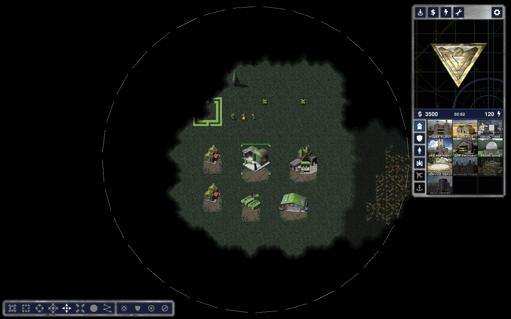
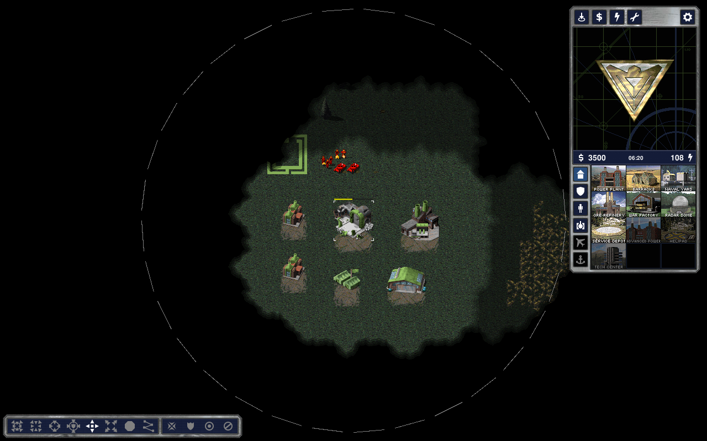
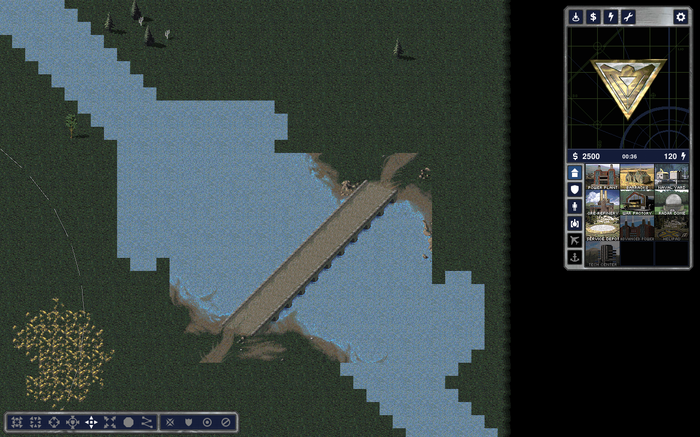
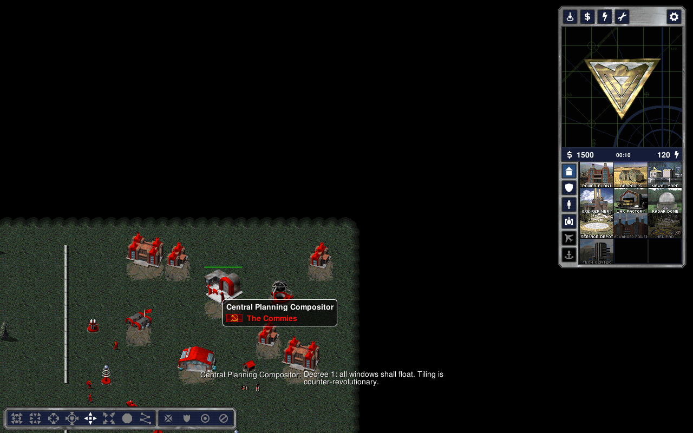

# Red Alert: Omarchy Edition

A single scripted single-player mission for stock OpenRA Red Alert
(release-20250330): the Omarchians versus the Commies. One `.oramap`, no
engine changes, no bundled art. Text, numbers and a Lua script only.

* `omarchy-edition.oramap` — the deliverable. See `INSTALL.md`.
* `omarchy-edition/` — the unzipped source (`map.yaml`, `map.bin`,
  `map.png`, `rules.yaml`, `sequences.yaml`, `omarchysign.shp`,
  `omarchy.ftl`, `omarchy.lua`).
* `tools/roster.py` — **every name and tooltip in the game, one table per
  side.** Edit this, rebuild, done.
* `tools/build_map.py` — deterministic generator for `map.bin`, `map.yaml`,
  `map.png`, the logo sprite, and (via `build_text.py` / `build_icons.py`)
  `omarchy.ftl`, `rules.yaml`, `sequences.yaml` and the 43 sidebar icons;
  `tools/package.sh` regenerates and zips. Requires Python 3, Pillow, and
  two build-time inputs that are not committed:
  `OMARCHY_PAL=/path/to/temperat.pal` (extract from the game content with
  `utility.sh ra --extract temperat.pal`) and `OMARCHY_FONTS=/dir/with/JetBrainsMono-*.ttf`
  (SIL OFL, https://github.com/JetBrains/JetBrainsMono).
* `NOTES.md` — what was verified against the engine source, what was not,
  deviations, confidence.

Rebuild:

```sh
OMARCHY_PAL=~/temperat.pal OMARCHY_FONTS=~/fonts/ttf sh tools/package.sh
```

Lint with an engine checkout at tag release-20250330:

```sh
TREAT_WARNINGS_AS_ERRORS=true ./utility.sh ra --check-yaml /path/to/omarchy-edition.oramap
```

## In-engine screenshots

Captured from the real OpenRA client (release-20250330, software OpenGL under
Xvfb) running this map; see `screenshots/` and NOTES.md step 4.7.

| | |
|---|---|
|  |  |
|  |  |
