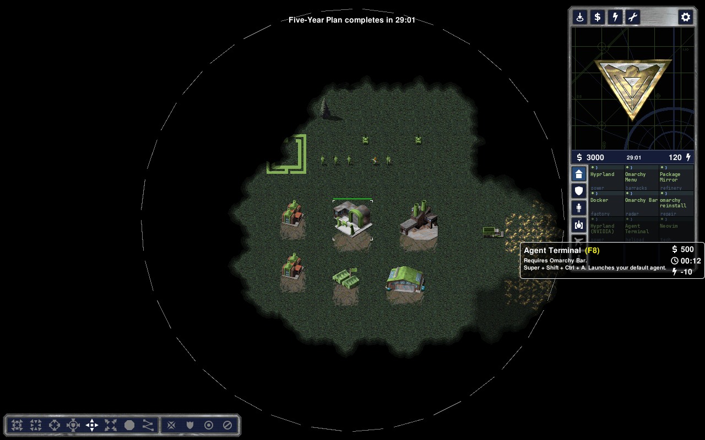

# Command & Conquer: Omarchy Edition

Build the ISO. Harvest packages. Send DHH and the coding agents to deal
with the Central Planning Compositor.

An Omarchy-themed **OpenRA Red Alert skirmish**, built for fun: green
Omarchians against the Commies, terminal-style build icons, and a roster
of familiar desktop tools with rather more firepower.

The new **Package Conflict** map gives both sides room to build, equal ore
fields and normal skirmish AI. No scripted waves or campaign countdown.
It is the next playable prototype; a full match on the XPS is still needed
to check the balance and presentation.

**[Build and play the skirmish →](SKIRMISH.md)**

Requires OpenRA Red Alert `release-20250330` and its game content. This
uses the original Red Alert foundation, not Red Alert 2 or Yuri's Revenge.

## What it looks like so far

These screenshots are from the earlier mission prototype. They show the
shared roster and custom icons, not the new skirmish battlefield.

| | |
|---|---|
|  |  |

Units and buildings still use stock Red Alert battlefield artwork. Original
Omarchy unit and building sprites are a possible next step.

## Make it yours

`tools/roster.py` holds the names and descriptions. `tools/build_skirmish.py`
builds the map using the committed sidebar artwork, with Python and Pillow.
Changing the icon artwork still uses the existing palette/font workflow in
`tools/build_icons.py`.

The earlier mission and its build tools remain in `omarchy-edition/`;
[INSTALL.md](INSTALL.md) covers that archived prototype and
[NOTES.md](NOTES.md) records its development history. Current skirmish scope
and testing limits are in [SKIRMISH.md](SKIRMISH.md).
