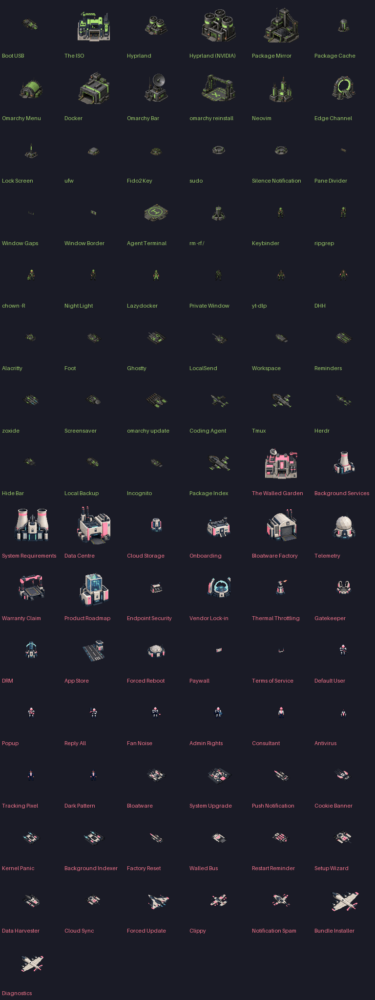

> **Bundled preview 7:** includes a pinned engine and runtime, with the custom roster built into the mod. [Download the installer](https://github.com/tcballard/command-and-conquer-omarchy/releases/tag/v0.0.1-preview.7). It no longer depends on the system OpenRA package. First launch may download Red Alert terrain and sounds.

# Command & Conquer: Omarchy Edition


Build the ISO. Harvest packages. Send DHH and the coding agents into battle.

An Omarchy-themed **OpenRA Red Alert skirmish**, built for fun. The green
Omarchians face **The Walled Garden**: Bloatware tanks, Forced Update jets,
Telemetry, and a particularly aggressive Antivirus.

**Package Conflict** gives both sides room to build, equal ore fields and
normal skirmish AI. No scripted waves or campaign countdown.

**[Download the preview installer →](https://github.com/tcballard/command-and-conquer-omarchy/releases/download/v0.0.1-preview.7/install-omarchy-edition.sh)**

One file includes the pinned engine, runtime, custom artwork and map, and
adds an app-menu launcher that opens straight into the Omarchy-only skirmish
lobby. On your x86_64 Omarchy PC, run:

```bash
bash ~/Downloads/install-omarchy-edition.sh
```

[Setup, first launch and uninstall →](SKIRMISH.md) · [Preview release notes →](https://github.com/tcballard/command-and-conquer-omarchy/releases/tag/v0.0.1-preview.7)

## A custom army on both sides



Original building, vehicle, aircraft and infantry artwork, illustrated build
icons, rotating tank turrets, aircraft rotors, damage states and matching
wrecks. The coding-agent helicopters and long-haired DHH are in the build.
Animations are a first pass; a complete XPS match still needs to verify the
presentation and balance.

Includes OpenRA Red Alert `release-20250330`; its game content downloads on first launch. Terrain,
sound, projectiles and the underlying game still use the Red Alert foundation.
This is not Red Alert 2 or Yuri's Revenge.

## Make it yours

Names live in `tools/skirmish_roster.py`. The [art sources](assets/README.md)
and sprite compiler are included, so everything can be rebuilt with Python
and Pillow. Run `sh tools/install_skirmish.sh` from a complete checkout.

The earlier mission remains archived in `omarchy-edition/`.
[INSTALL.md](INSTALL.md) and [NOTES.md](NOTES.md) describe that prototype;
[SKIRMISH.md](SKIRMISH.md) describes the current game and its testing limits.
