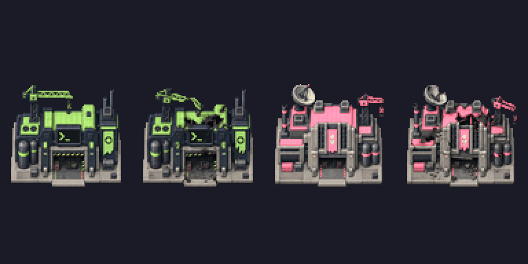

# Omarchy Skirmish

Build your base. Harvest packages. Send the coding agents in.

**Package Conflict** is a two-player land skirmish for stock OpenRA Red Alert
`release-20250330`. Play the green Omarchians against a Soviet AI opponent,
with the existing Omarchy roster and custom sidebar icons. DHH is trainable
from the barracks once you have Neovim, using Tanya's normal cost and one-unit
limit. There are no scripted waves, mission objectives or Five-Year Plan
deadline. The normal skirmish victory rules apply.

## Play on Omarchy

Install OpenRA and its Red Alert content first. In a complete checkout:

```sh
sudo pacman -S --needed openra python-pillow
sh tools/install_skirmish.sh
```

The installer builds and copies the map into your user-local OpenRA map
directory, including the legacy `~/.openra` location when present. It does
not modify the game installation. For a custom location:

```sh
sh tools/install_skirmish.sh --dest /path/to/openra/maps/ra/release-20250330
```

Restart OpenRA Red Alert, open **Singleplayer → Skirmish**, and select
**Omarchy Skirmish - Package Conflict**. Take the first (green Omarchian)
slot and put **Normal AI** in the second (pink Commie) slot. Both slots
must be occupied. Starting cash defaults to $10,000 and starting units to
Light Support; both remain adjustable. Rush AI and Turtle AI are also
available. Avoid Naval AI on this land map.

The same map can be hosted for two humans. Factions, colours and starting
positions are fixed for this first version. Steam and Yuri's Revenge are
not required for this OpenRA map.

## What carries over

- The roster, humour, Omarchy colours and logo preview. Both factions now
  have their own terminal-style sidebar icons, selected by the producing
  factory's faction, including shared units.
- Standard Red Alert economy, build prerequisites and bot modules. Shared
  units keep their original actor IDs so AI production, harvesting, MCV
  deployment and captured factories still use the stock rules.
- Shared units get faction-dependent names on the battlefield. Shared
  build-menu tooltip names/descriptions still use the Omarchian version on
  both sides; the icons themselves now show the correct faction names.
- A larger, rotationally symmetric battlefield, six regenerating ore mines
  and open ground between bases. Rocky flanks, debris and a central village
  add landmarks and obstacles without changing the equal starting economy.
  No prebuilt campaign bases or free waves.

The older mission remains in `omarchy-edition/` as an archive of the prototype.
Its mission script and old icon files are not included in this map.

## Original construction yards

Both construction yards now use original sprites: a terminal workshop for
the Omarchians and a bureaucratic industrial block for the Commies. Each has
healthy/damaged art, a twelve-frame deployment reveal, a production pulse
and a dissolving wreck. Roof accents use player colours, including after
capture. These are simple first-pass animations; their fit against the
stock terrain and bib still needs an in-game visual check.



The source sheet, provenance and original prompt are in [assets/](assets/README.md).
Rebuilding now generates all custom sprites, icons and the palette from our
own sources. No extracted EA palette or separate font download is needed.
The rest of the battlefield units still use stock artwork. A light tank,
coding-agent aircraft and DHH hero are good next candidates.

## Validation

`python -m unittest discover -s tests -v` checks equal starting resources,
clear deployment areas, ground routes, binary resource placement, Fluent
references, original sprite frames, player-colour indices and reproducible
packaging with all referenced icons present.
GitHub Actions additionally builds OpenRA `release-20250330` and runs the
engine's YAML lint with warnings treated as errors. A passing run provides
the installable `omarchy-skirmish` artifact. It also decodes all 68 yard
frames through OpenRA's own sprite loader and publishes art previews.

These are not playtest claims. Before calling this ready: play a complete
match on the XPS, observe the AI deploy/build/harvest/attack, train DHH and
the aircraft, and check victory/defeat and battlefield tooltips. Balance
and the visual feel still need that playtest.
